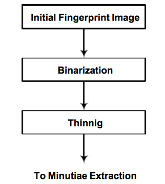
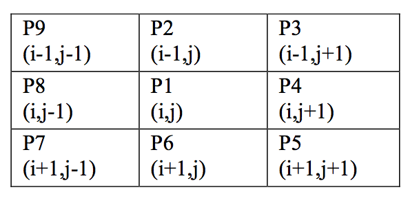
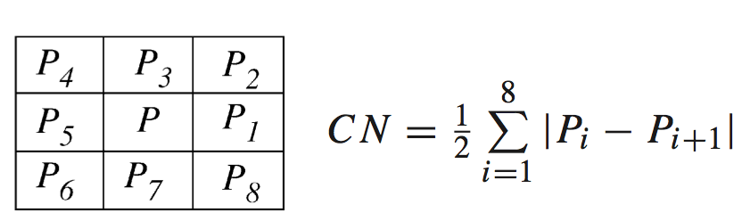
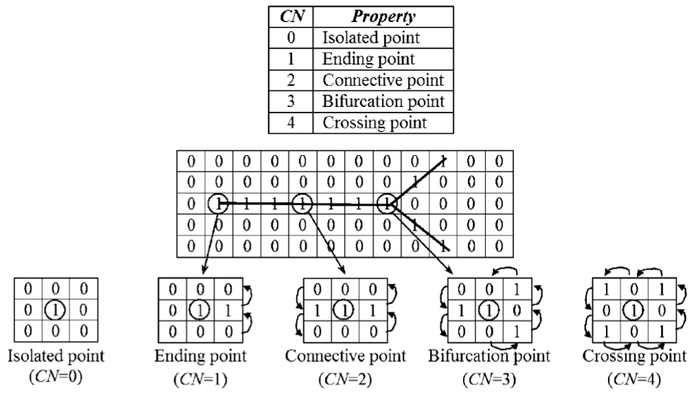

# Steps I used:

First we will convert images to greyscale as RGB(x,y)= (R(x,y)+G(x,y)+B(x,y))/3
then, follow these steps:

# Thinning process & generating the Skeleton:

Based on the “A Fast Parallel Algorithm for Thinning Digital Patterns” by T. Y. Zhang & C.Y. Suen, for each center point P1, it's neighboring cells will be defined by:

We go through all center cells and see which cells to re-color as Black/1 based on these conditions:

* 3 <= B(P1)= P2+P3+P4+P5+P6+P7+P8+9 <= 6
* A(P1)= 1; center point must be Black/1 itself!

* FOR EVEN iterations ((x+y)%2==0):
**	P2*P4*P6=0
**	P4*P6*P8=0 , where (*) indicates ANDing or multiplying!

* FOR OLD iterations ((x+y)%2==1):
**	P2*P4*P8=0
**	P2*P6*P8=0 , where (*) indicates ANDing or multiplying!

# Minutiae extraction using Rutovitz’s Crossing-Number:

For each center point (P1), values are calculated by:

# References:

*
* [Binarization and Thinning of Fingerprint Images by Pipelining, MVIP Tehran 2005]( http://www.academia.edu/1946178/Binarization_and_Thinning_of_Fingerprint_Images_by_Pipelining )